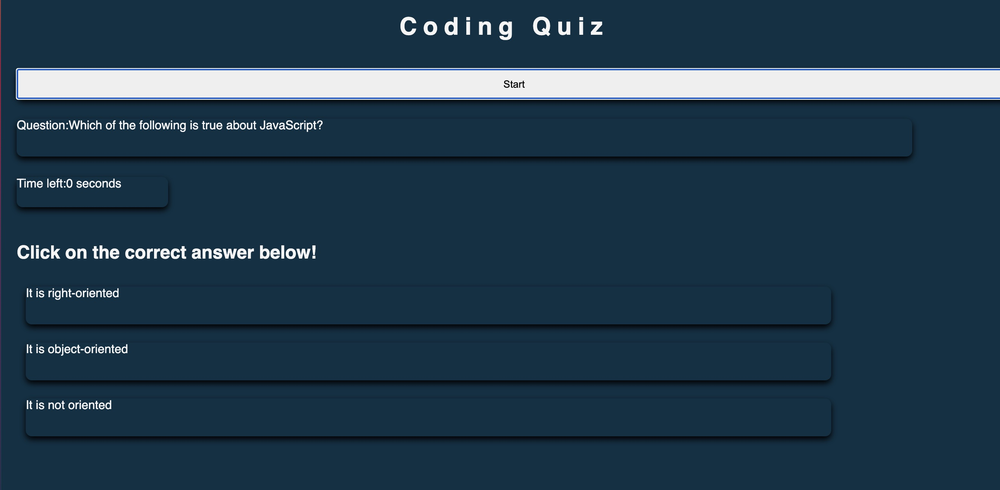

# <Coding Quiz>

## Description

This project is a quiz that generates questions related to JavaScript, counts down the time remaining, and deducts time for wrong answers.

## Installation

Open the script.js, style.css and index.html files in VS Code.

## Usage

Click the start button. A first question and corresponding answers will appear.

[a link] https://mwathomas.github.io/coding-quiz/

Next steps to be built out could be different types of questions, such as True/False, multiple selection, etc.

## Credits

No collaborators on this project
